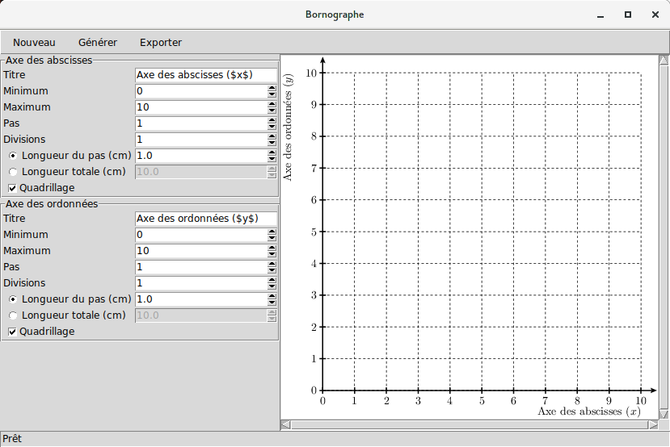

Bornographe
===========

*Bornographe* est un petit logiciel destiné à génerer des repères de graphiques vierges. Il est nommé en l’honneur de [Cyrille BORNE](https://cyrille-borne.com), puisque c’est pour lui qu’il a été écrit.

La version actuelle est considérée comme un prototype.

Dépendances
-----------

* Python 3 (CPython recommandé)
* [PyX](https://pypi.python.org/pypi/PyX) pour Python 3
* [PIL](https://pypi.python.org/pypi/PIL) pour Python 3

Installation et exécution
-------------------------

L’installation se fait simplement en plaçant les fichiers .py dans un répertoire quelconque.

Pour lancer le logiciel, exécuter bornographe.py:

    chmod +x bornographe.py
    ./bornographe.py

ou

    python3 bornographe.py

Utilisation
-----------

Le logiciel se compose de trois zones principales :

* une barre d’outil en haut de la fenêtre comprenant trois boutons,
* un panneau de contrôle sur la gauche de la fenêtre pour définir les paramètres du repère,
* une zone de prévisualisation sur la droite.

La configuration de l’axe des abscisses et de l’axe des ordonnées est identique. On a accès à huit options pour chaque axe :

* **Titre :** le titre du graphique. La syntaxe LaTeX est supportée.
* **Minimum :** la borne inférieure de l’axe.
* **Maximum :** la borne supérieure de l’axe.
* **Pas :** le nombre d’unités entre chaque graduations.
* **Divisions :** le nombre de divisions du quadrillage entrre chaque graduation.
* **Longueur du pas :** longueur en centimètred entre chaque graduation.
* **Longueur totale :** longueur en centimètres entre la borne inférieure et la borne supérieure.
* **Quadrillage :** affiche ou non le quadrillage de l’axe.

Le nombre de divisions n’est accessible que si on active le quadrillage.

On ne peut pas régler à la fois la longueur du pas et la longueur totale. En réglant l’une, l’autre est automatiquement modifiée.

Passons à la barre d’outils :

* Le bouton **Nouveau** réinitialise le logiciel. Les modifications qui auraient été effectuées seront définitivement perdues. On peut également presser <kbd>Ctrl</kbd><kbd>N</kbd> pour obtenir le résultat
* Le bouton **Générer** (ou la touche <kbd>F5</kbd>) régénère l’aperçu. Celui-ci n’est pas mis à jour automatiquement pour des raisons de performance.
* Le bouton **Exporter** (ou <kbd>Ctrl</kbd><kbd>E</kbd>) permet d’enregistrer le graphique au format SVG.

Pour quitter le logiciel, fermez simplement la fenêtre ou utiliser les combinaisons de touches <kbd>Ctrl</kbd><kbd>Q</kbd> ou <kbd>Alt</kbd><kbd>F4</kbd>.

